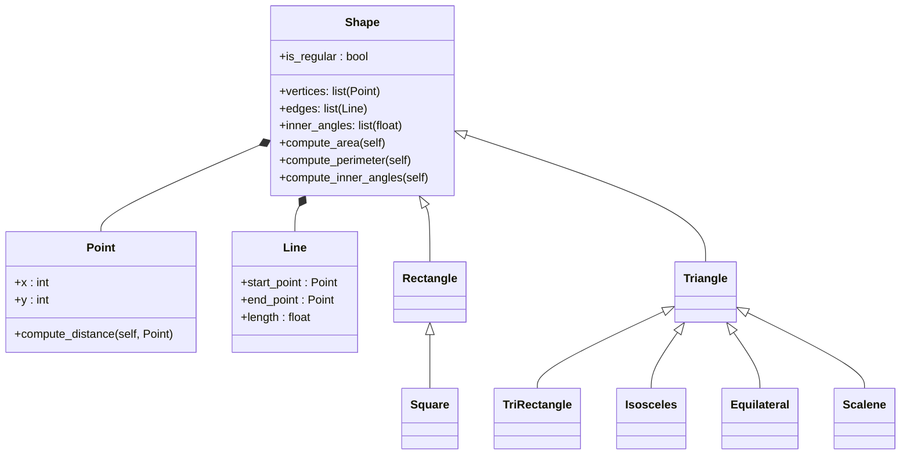

# Ejercicio 1
1. Create a superclass called Shape(), which is the base of the classes Reactangle() and Square(), define the methods compute_area and compute_perimeter in Shape() and then using polymorphism redefine the methods properly in Rectangle and in Square.

2. Using the classes Point() and Line() define a new super-class Shape() with the following structure:

[Solución_en_python](ejercicio1.py)
Utilice herencia, composición, encapsulación y polimorfismo para definir las clases. Todos los atributos deben tener sus respectivos métodos setter y getter.

# Reto 4:

1. Incluye el ejercicio de clase en el repositorio.

2. El restaurante volvió a visitar

- Agregue métodos setter y getter a todas las subclases para el elemento de menú.

- Sobrescribe la función calculate_total_price() según la composición del pedido (por ejemplo, si el pedido incluye un plato principal, aplica algún descuento a las bebidas).

- Agregue la clase Payment() siguiendo el ejemplo de clase.

[Solución_en_python](restaurant.py)