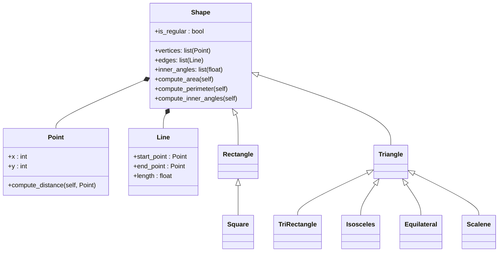

# Ejercicio 1
1. Create a superclass called Shape(), which is the base of the classes Reactangle() and Square(), define the methods compute_area and compute_perimeter in Shape() and then using polymorphism redefine the methods properly in Rectangle and in Square.

2. Using the classes Point() and Line() define a new super-class Shape() with the following structure:


Python
```python
```